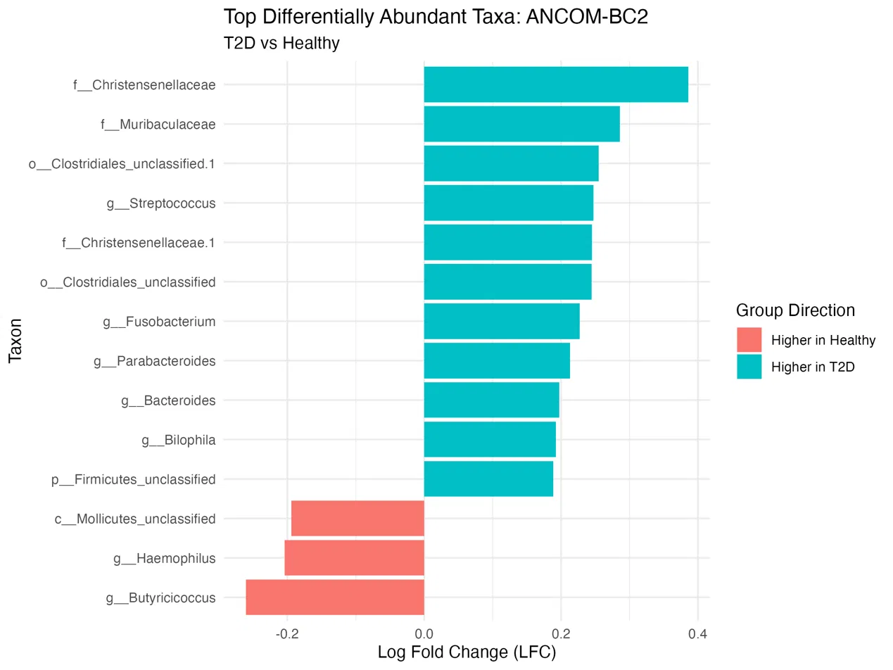
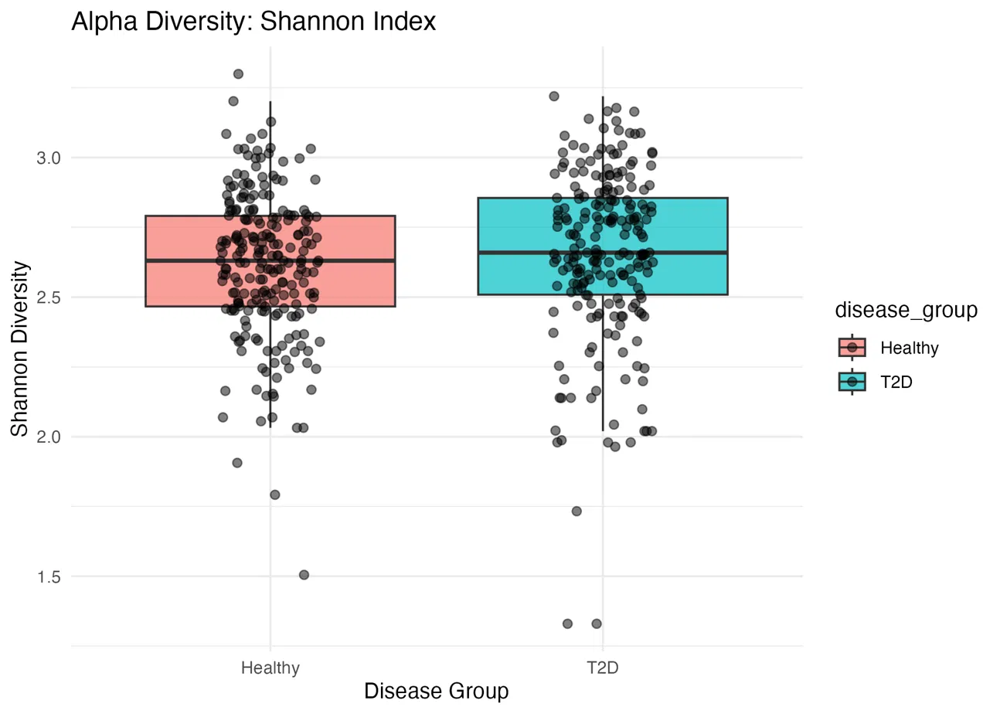
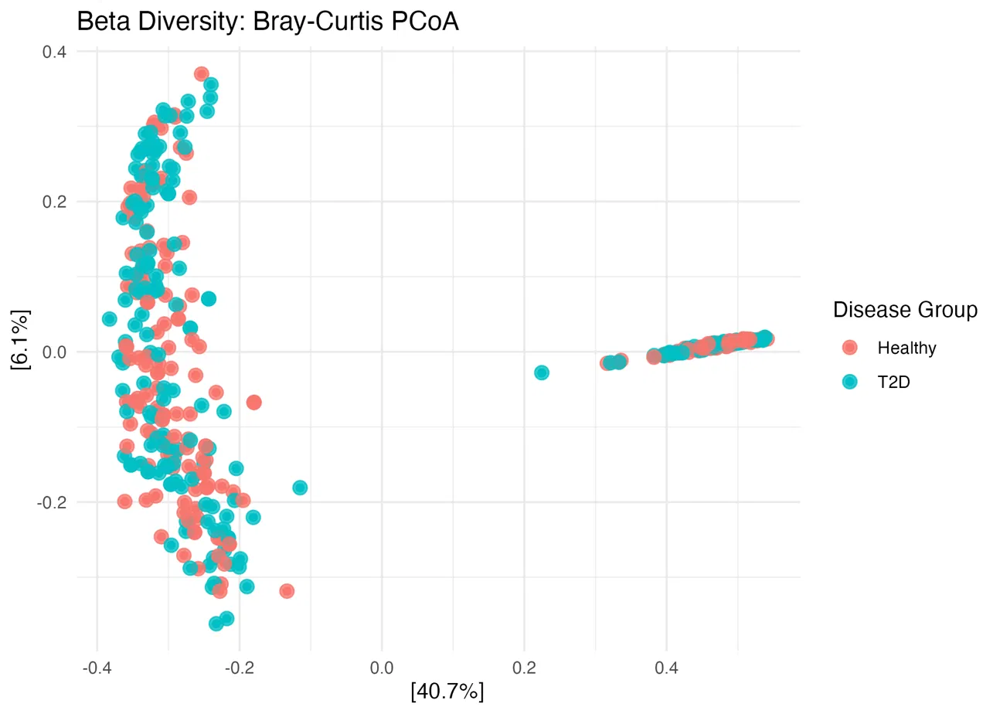

# 🦠 Gut Microbiome Analysis: Type 2 Diabetes vs. Healthy (R Pipeline)
 
An end-to-end bioinformatics pipeline that queries the MGnify API for 16S rRNA taxonomic profiles, integrates them with patient phenotype metadata, and compares gut microbial diversity and composition between individuals with Type 2 Diabetes (T2D) and healthy controls.
 
This folder contains the **R** implementation of the pipeline, covering data acquisition, alpha/beta diversity, and differential abundance testing via two independent methods (DESeq2 and ANCOM-BC2).
 
## Why this matters?
The gut microbiome has been repeatedly implicated in the pathophysiology of Type 2 Diabetes, particularly through depletion of butyrate-producing bacteria and shifts in a limited set of taxa rather than a wholesale restructuring of the community. This pipeline automates a standard, reproducible microbiome comparison workflow — from raw MGnify sequence data to statistically tested, taxonomy-annotated biomarker tables, as a scriptable alternative to manually assembling diversity and differential abundance analyses.
 
---
 
## 📊 Example Output
 
**Differentially abundant taxa** — log fold change of taxa significantly associated with disease status (ANCOM-BC2, q < 0.05):
 

 
*Butyricicoccus*, a known butyrate producer, is depleted in T2D — consistent with prior literature linking reduced butyrate production to T2D-associated dysbiosis. Enrichment in T2D is concentrated in a small set of taxa (e.g., Christensenellaceae, *Fusobacterium*, *Bilophila*), rather than reflecting a global shift in community composition.
 
**Diversity comparisons**:
 
<table>
<tr>
<td></td>
<td></td>
</tr>
</table>
Alpha diversity (Shannon) differs modestly but significantly between groups (Wilcoxon p = 0.036); beta diversity ordination (Bray-Curtis PCoA) shows substantial overlap between T2D and Healthy samples, with PERMANOVA confirming a statistically significant but very small effect (R² = 0.006, p = 0.022).
 
---
 
## 🏗️ Project Architecture
 
```text
.
├── README.md                          # Project documentation
├── setup_environment.R                # One-time script to install all required packages
├── Bioinformatics_Project_1.r         # Main analysis pipeline
├── sampleID.csv                       # (user-provided) patient phenotype metadata — not included
├── metadata/                          # Cleaned and merged sample metadata
├── data_clean/                        # Saved TreeSE / phyloseq R objects (.rds)
├── results/                           # Statistical outputs (CSV) and saved workspace
└── figures/                           # Output plots (PNG)
```
 
---
 
## 🛠️ Requirements & Installation
 
### 1. System Requirements
* **R** version ≥ 4.2
* Internet access (the pipeline queries the MGnify API directly)
### 2. R Package Setup
All required CRAN and Bioconductor packages are installed automatically via the setup script:
 
```r
source("setup_environment.R")
```
 
This installs:
* **CRAN**: `ggplot2`, `dplyr`, `tidyr`, `readr`, `vegan`
* **Bioconductor**: `MGnifyR`, `phyloseq`, `mia`, `TreeSummarizedExperiment`, `SummarizedExperiment`, `S4Vectors`, `DESeq2`, `ANCOMBC`, `microbiome`
---
 
## 🚀 Running the Pipeline
 
1. Place a `sampleID.csv` file in the working directory containing at least the columns `BioProject`, `Disease`, and `sample.ID`, matching samples to BioProject **PRJNA422434** with disease status `Healthy` or `T2D`.
2. Run the pipeline:
```r
source("Bioinformatics_Project_1.r")
```
 
### Configuration
Key parameters are set at the top of `Bioinformatics_Project_1.r` and can be edited directly:
 
* **`STUDY_ID`**: MGnify study accession to query (default: `MGYS00005285`)
* **`BIOPROJECT_ID`**: BioProject accession used to filter metadata (default: `PRJNA422434`)
* **`DISEASE_KEEP`**: Disease groups to retain (default: `c("Healthy", "T2D")`)
* **`MIN_PREVALENCE`**: Minimum sample prevalence for a taxon to be included in differential abundance testing (default: `0.05`)
* **`SEED`**: Random seed for reproducibility of permutation-based tests (default: `123`)
The script queries MGnify and caches downloaded results locally (`.mgnify_cache/`) to avoid re-downloading on subsequent runs.
 
---
 
## 📁 Pipeline Results
 
The pipeline writes all outputs to the following directories:
 
* **`metadata/patient_metadata_PRJNA422434_T2D_Healthy_clean.csv`**: Filtered patient phenotype metadata
* **`metadata/mgnify_metadata_raw.csv`**: Raw MGnify sample metadata
* **`metadata/combined_metadata_PRJNA422434_T2D_Healthy.csv`**: Merged phenotype + MGnify metadata
* **`data_clean/tse_PRJNA422434_T2D_Healthy_with_metadata.rds`**: TreeSummarizedExperiment object
* **`data_clean/phyloseq_PRJNA422434_T2D_Healthy_filtered.rds`**: Filtered phyloseq object
* **`results/alpha_diversity_T2D_vs_Healthy.csv`**: Per-sample Observed/Shannon/Simpson diversity
* **`results/alpha_diversity_wilcox_tests.csv`**: Wilcoxon rank-sum test results
* **`results/permanova_bray_T2D_vs_Healthy.csv`**: PERMANOVA (`adonis2`) results
* **`results/differential_abundance_DESeq2_T2D_vs_Healthy_poscounts.csv`**: Full DESeq2 results
* **`results/top10_biomarker_taxa_DESeq2_poscounts.csv`**: Top 10 DESeq2 taxa by adjusted p-value
* **`results/differential_abundance_ANCOMBC2_raw_T2D_vs_Healthy.csv`**: Raw ANCOM-BC2 output
* **`results/differential_abundance_ANCOMBC2_clean_T2D_vs_Healthy.csv`**: Cleaned primary-contrast results
* **`results/differential_abundance_ANCOMBC2_with_taxonomy_T2D_vs_Healthy.csv`**: Taxonomy-annotated results
* **`results/significant_taxa_ANCOMBC2_T2D_vs_Healthy.csv`**: Taxa significant at q < 0.05
* **`results/top10_biomarker_taxa_ANCOMBC2.csv`**: Top 10 ANCOM-BC2 taxa by q-value
* **`results/microbiome_project_workspace.RData`**: Full saved R workspace
* **`figures/alpha_diversity_shannon_T2D_vs_Healthy.png`**: Shannon diversity boxplot
* **`figures/beta_diversity_bray_pcoa_T2D_vs_Healthy.png`**: Bray-Curtis PCoA ordination
* **`figures/beta_dispersion_T2D_vs_Healthy.png`**: Beta dispersion plot
* **`figures/top_differential_abundance_ANCOMBC2_T2D_vs_Healthy.png`**: Top differentially abundant taxa
---
 
## 🔎 Data Availability
 
Raw sequence data and study metadata are publicly available via [MGnify (MGYS00005285)](https://www.ebi.ac.uk/metagenomics/studies/MGYS00005285) and [NCBI BioProject PRJNA422434](https://www.ncbi.nlm.nih.gov/bioproject/PRJNA422434). This repository does not redistribute raw sequencing data; the pipeline downloads it directly from MGnify on execution.
 
 
## Citation / Acknowledgments
 
If you use this pipeline or its outputs, please cite the original MGnify study (PRJNA422434) and the following tools: MGnifyR, phyloseq, mia, vegan, DESeq2, and ANCOM-BC2.
 
